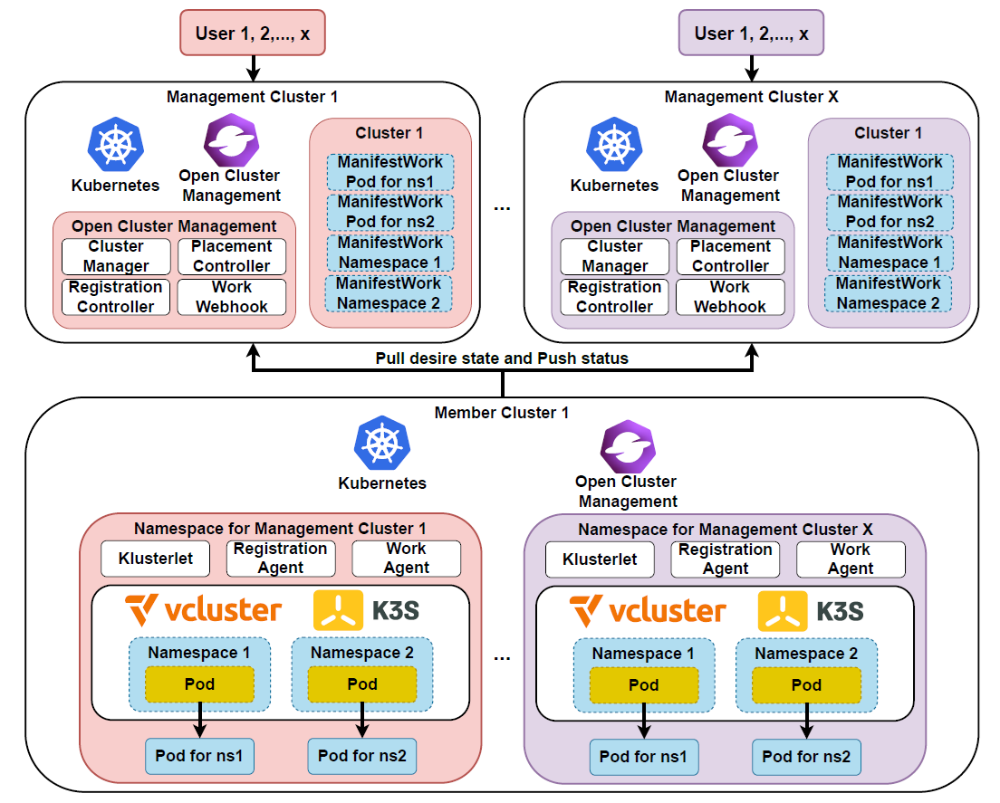
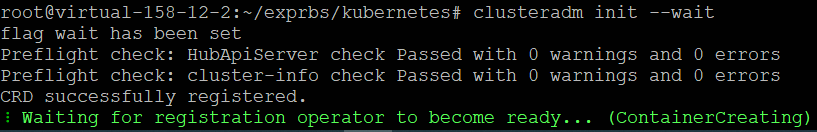
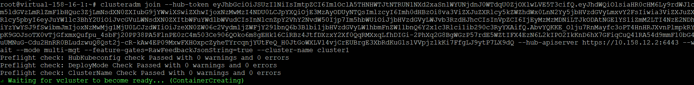
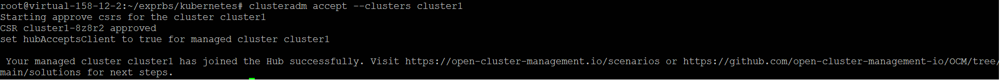
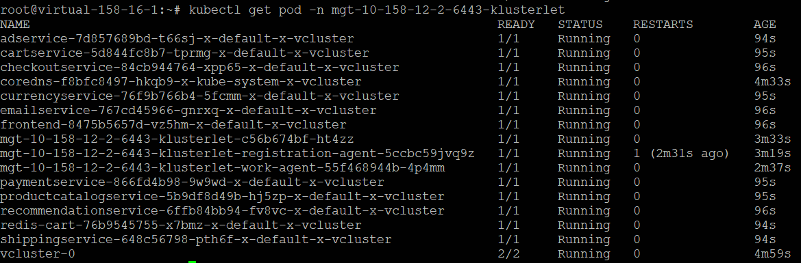

# UnBound: Multi-Tenancy Management in Scalable Fog Meta-Federations

## Abstract
We propose UnBound, a scalable fog meta-federations framework that addresses the complex multi-tenancy and scalability challenges introduced by meta-federations, where individual fog clusters may lease their resources to multiple administrative domains. UnBound uses [Kubernetes] to orchestrate resources within individual fog clusters and [Open Cluster Management] (OCM) to federate multiple member clusters under the authority of a management cluster. OCM is a multi-cluster orchestration tool that manages clusters and distributes workloads across them. We address the issue of multi-tenancy management by isolating federations within a single member cluster using the [Virtual Kubernetes Clusters] (vCluster) project to create isolated logical sub-clusters within the member clusters. Each vCluster has its own API server and data store, which provides stronger isolation guarantees than simple Kubernetes Namespaces to ensure that different federations do not interfere with one another.


## Architecture
The figure below shows the architecture of UnBound.

<p align="center"></p>

## Information
This repository offers a tool built on the [clusteradm], enabling seamless installation of necessary components from OCM and vCluster for UnBound.

> Note: Some sections in this README reuse parts of the clusteradm documentation.

This project is currently under active development and remains in a pre-stable state, making it unsuitable for production environments.

We welcome contributions of any kind—feel free to share feedback, submit issues, and contribute improvements!


## Related publications


# clusteradm CLI

clusteradm CLI allows you to interact with open cluster management to manage your UnBound platform from the command-line.

## Quick start

### Install the clusteradm command-line:

#### From source:

Go 1.17 is required in order to build on this tool as it leverage the `go:embed` tip.
The binary will be installed in `$GOPATH/bin`

```bash
git clone https://github.com/CKHuang-public/UnBound.git
chmod 777 UnBound/
cd UnBound/
make build
cp /root/go/bin/clusteradm /usr/local/bin/clusteradm
clusteradm
```

This tool should be installed in all clusters.

### Environment
To set up this environment, you'll need:

* At least one Kubernetes Cluster for Management
`A dedicated Kubernetes cluster will act as the UnBound management cluster, responsible for overseeing and coordinating other clusters.`
* At least one Kubernetes Member Clusters
`Additional Kubernetes clusters that will be managed by the management cluster and on which the actual workloads will run. These are referred to as member clusters.`

* Administrative Access and kubeconfig Files
`We assume that you have administrative access to each Kubernetes cluster, and that the kubeconfig files for all clusters are readily available.`

### Initialize a management cluster and join a member cluster

```bash
# Initialize a management cluster (hub)
kubectl config use-context <management cluster context>
clusteradm init --wait

# Request a member cluster to join the management cluster
kubectl config use-context <member cluster context>
clusteradm join --hub-token <token> --hub-apiserver <api server url> --wait --mode multi-mgt --cluster-name <cluster name>

# Accept the member cluster request on the management cluster
kubectl config use-context <management cluster context> # 
clusteradm accept --clusters <list of clusters> # clusteradm accept --clusters cluster1,cluster2,...
```

After each above clusteradm command, the clusteradm will print out the next clusteradm command to execute, which can be copied/pasted.


### Example figures
Below is some example figures.

Initialize a management cluster.
<p align="center"></p>

Request a member cluster to join the management cluster
<p align="center"></p>

Accept the member cluster request on the management cluster
<p align="center"></p>

A microservice example. The way to create applications in UnBound is the same as [Open Cluster Management]. For example `clusteradm create work <name> -f <your YAML file> --clusters <cluster name>`
<p align="center"></p>


## Commands

The commands are composed of a verb and a noun and then a number of parameters.
Logs can be gather by setting the klog flag `-v`.
To get the logs in a separate file:
```
clusteradm <subcommand> -v 2 > <your_logfile>
```
or
```
clusteradm <subcommand> -v 99 --logtostderr=false --log-file=<your_log_file>
```

### version

Display the clusteradm version and the kubeversion

`clusteradm version`

### init

Initialize the management cluster by deploying the management side resources to manage member clusters.

`clusteradm init`

it returns the command line to launch on the member cluster to join the hub.

### get token

Get the latest token to import a new member cluster.

`clusteradm get token --context <management cluster context>`
### join

Install the agent on the member cluster.

`clusteradm join --hub-token <token> --hub-apiserver <hub_apiserver_url> --mode multi-mgt --cluster-name <unique name> [--force-internal-endpoint-lookup]`

it returns the command line to launch on the management cluster the accept the member cluster onboarding.

> NOTE: If you're trying to join a management cluster which is initialized from a kind cluster, please set the `--force-internal-endpoint-lookup` flag.

### accept

Accept the CSRs on the management cluster to approve the member clusters to join.

`clusteradm accept --clusters <cluster1>, <cluster2>,....`

### 

[Kubernetes]: https://github.com/kubernetes/kubernetes
[Open Cluster Management]: https://github.com/open-cluster-management-io/ocm
[Virtual Kubernetes Clusters]: https://github.com/loft-sh/vcluster
[clusteradm]: https://github.com/open-cluster-management-io/clusteradm